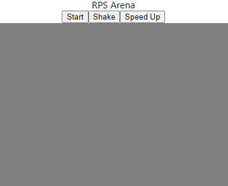

# Rock Paper Scissors Arena

Inspired by a short video that a co-worker sent me on Facebook, I decided that it would be easy enough to pack into a single React component to drop into a website. So I did it.

## Credits
The [Rock](https://www.svgrepo.com/svg/398225/rock) SVG was created by GoogleFonts under the [Apache license](https://www.svgrepo.com/page/licensing/#Apache).

The [Paper](https://www.svgrepo.com/svg/499911/paper) and [Scissors](https://www.svgrepo.com/svg/485389/scissors) SVGs were created by [Kerry](https://www.svgrepo.com/author/Kerry/) and [flat-icon-design](https://www.svgrepo.com/author/flat-icon-design/) respectively and are reproduced here under the [Public Domain License (or CC0)](https://www.svgrepo.com/page/licensing/#PD). 

All of the above SVG files were pulled from www.svgrepo.com.

# Boilerplate Readme Stuff

This project was bootstrapped with [Create React App](https://github.com/facebook/create-react-app).

## Available Scripts

In the project directory, you can run:

### `npm start`

Runs the app in the development mode.\
Open [http://localhost:3000](http://localhost:3000) to view it in the browser.

The page will reload if you make edits.\
You will also see any lint errors in the console.
